# 第 1 节：书生·浦语大模型全链路开源体系

### 目录

- 书生浦语大模型开源历程
- 大模型应用开发流程
- 书生浦语大模型开源全链条
  - 数据：书生万卷1.0，OpenDataLab
  - 预训练：XTuner高效微调训练框架，功能齐全。
  - 评测：OpenCompass评测系统。
  - 部署：LMDeploy提供了大模型在GPU上部署的全流程解决方案：模型量化，推理和服务。

### 1. 书生浦语大模型开源历程

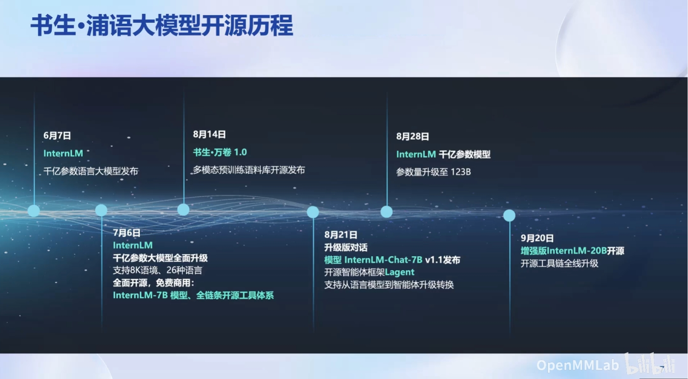

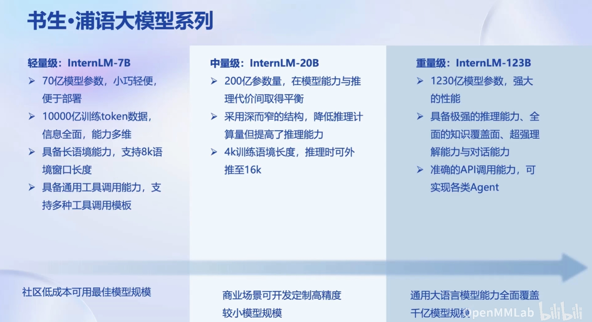

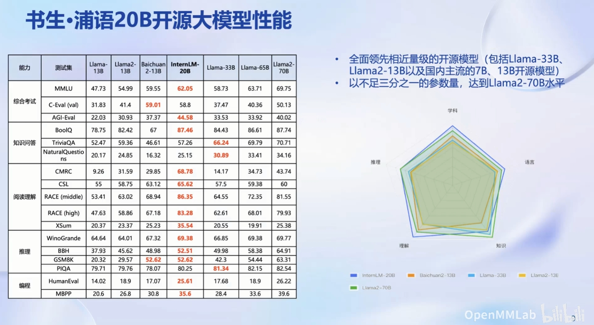

### 2. 大模型应用开发流程

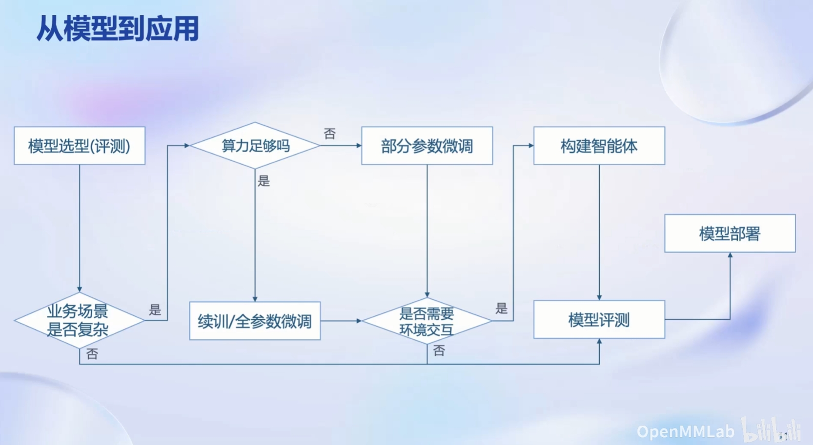

### 3. 书生浦语大模型开源全链条

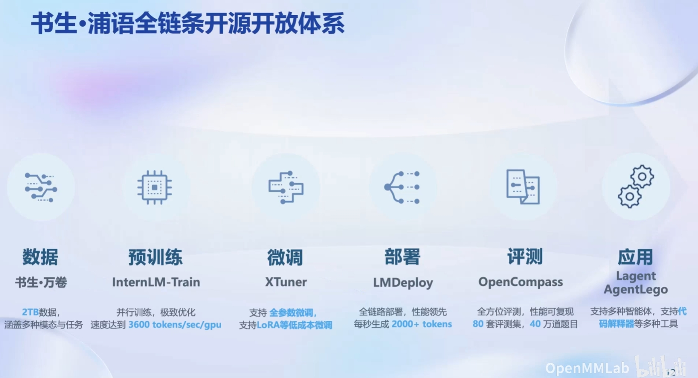

#### 3.1 数据

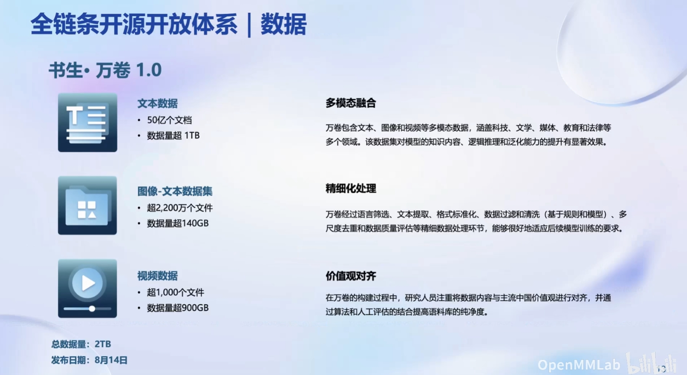

#### 3.2 预训练

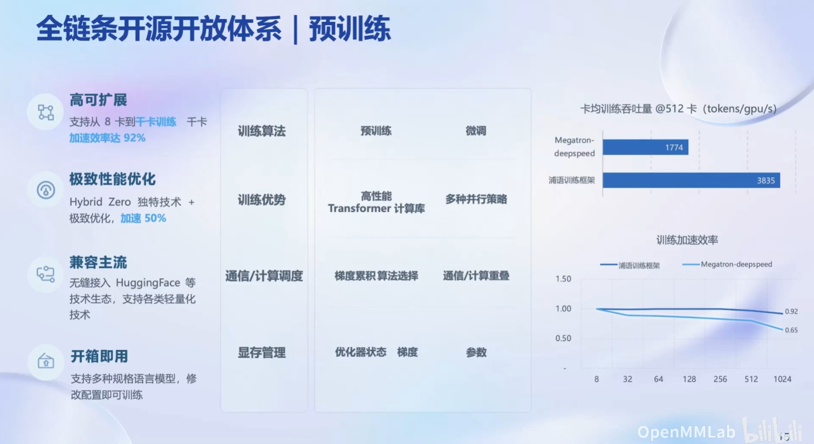

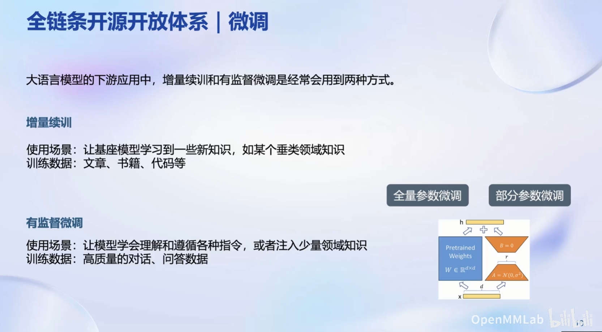

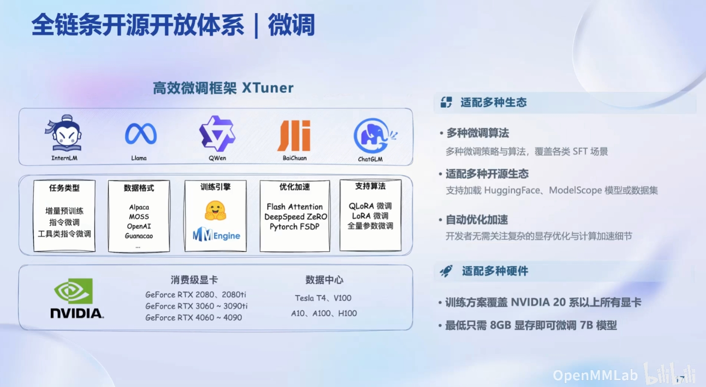

#### 3.3 模型评测

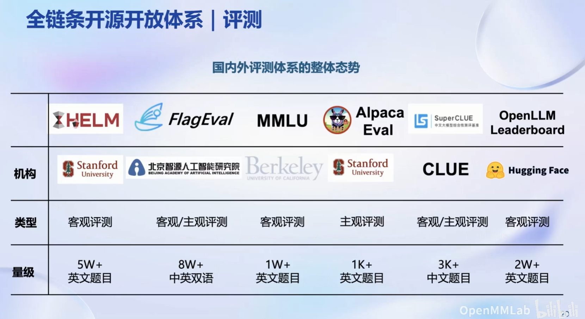

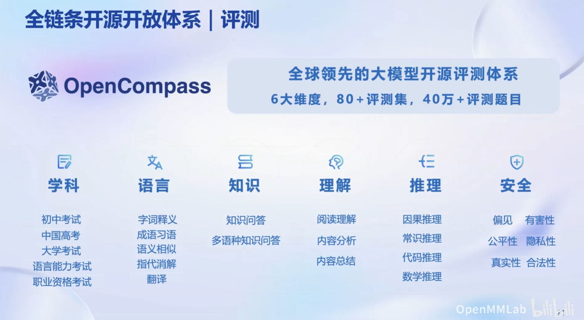

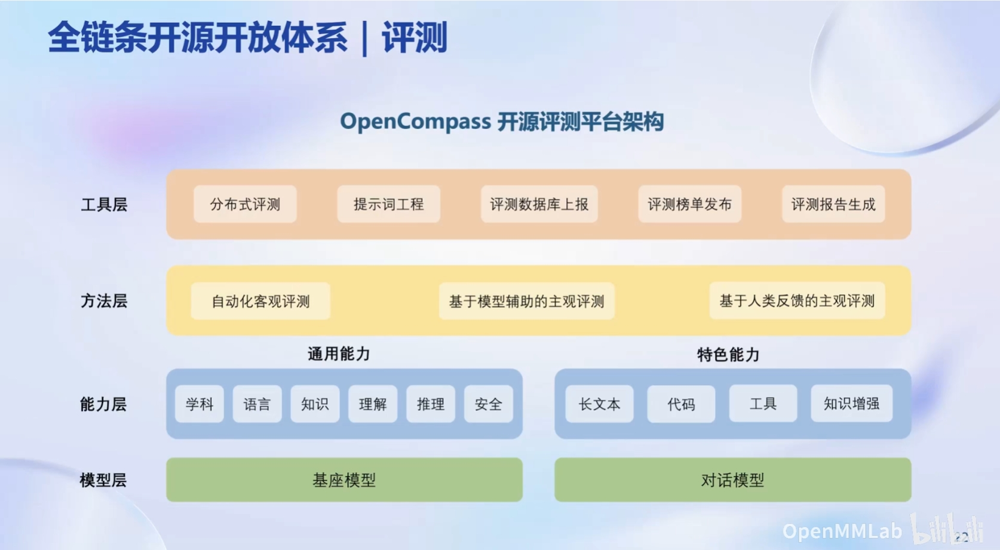

#### 3.4 模型部署

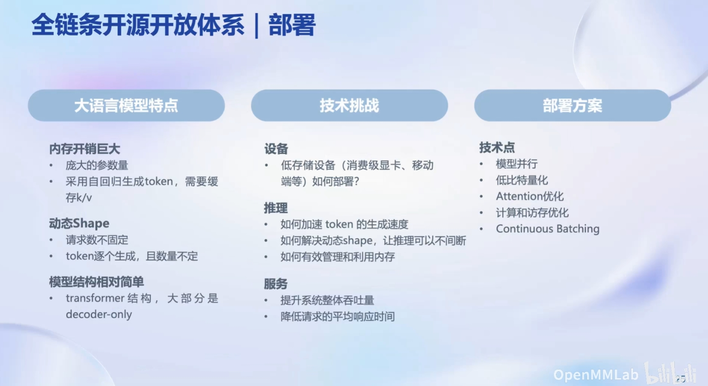

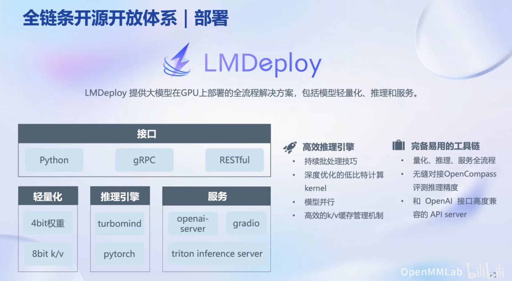
