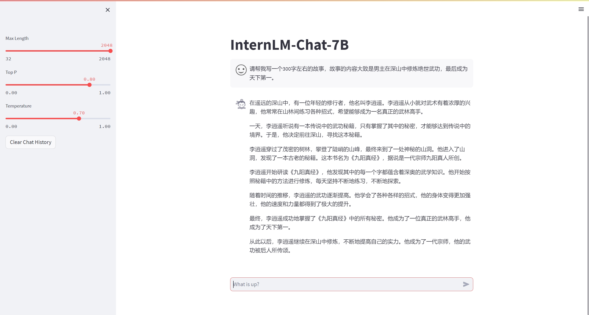
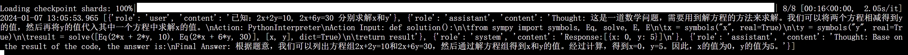
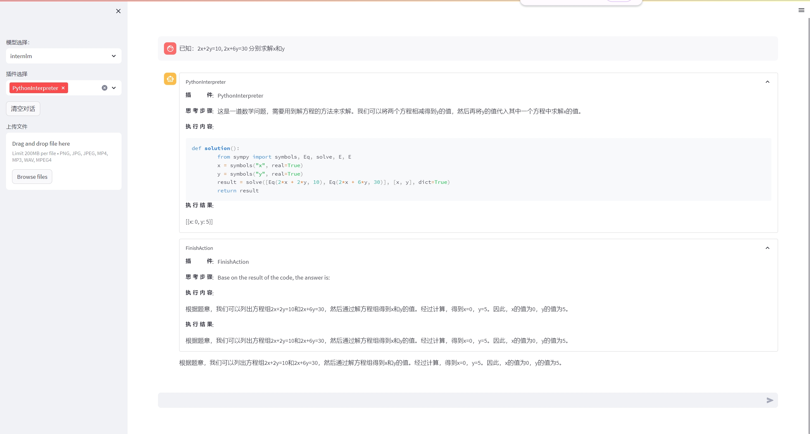
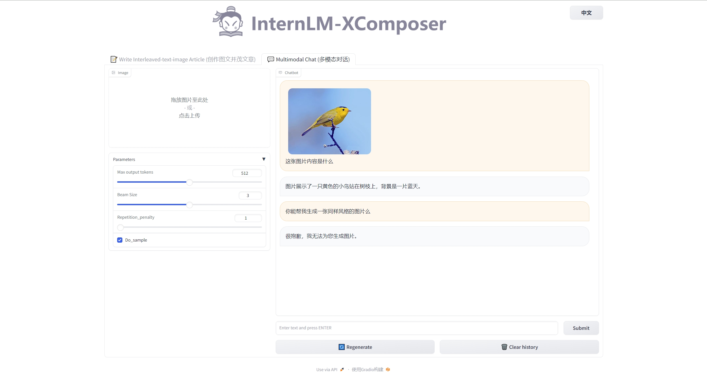

# 第2节：轻松玩转书生·浦语大模型趣味 Demo

### 目录

- 环境准备
- `internlm-chat-7b`模型下载
- Demo演示

### 1. 环境准备

安装必要的库，版本torch版本需要根据自己的CUDA版本确定。

```bash
# 创建虚拟环境
conda create --name internlm python=3.10
conda activate internlm
# 升级pip
python -m pip install --upgrade pip
## 可选项 配置pip源
pip config set global.index-url https://mirrors.cernet.edu.cn/pypi/web/simple

# 安装pip库 
pip install modelscope==1.9.5
pip install torch==2.0.1
pip install transformers==4.35.2
pip install streamlit==1.24.0
pip install sentencepiece==0.1.99
pip install accelerate==0.24.1

timm==0.4.12
gradio==3.44.4 
markdown2==2.4.10 
xlsxwriter==3.1.2 
einops 

```


### 2. 模型下载

#### 2.1 使用modelscope下载

创建一个以下内容的python程序，然后运行即可

```python
import torch
from modelscope import snapshot_download, AutoModel, AutoTokenizer
import os
model_dir = snapshot_download('Shanghai_AI_Laboratory/internlm-chat-7b', cache_dir='/root/model', revision='v1.0.3')
```

#### 2.2 使用huggingface-cli下载

没有安装`huggingface-cli`的执行`pip install -U huggingface_hub`完成安装。

```bash
# 在终端中输入以下命令
huggingface-cli download --resume-download internlm/internlm-chat-7b --local-dir 'your_path'
```


### 3. Demo演示

#### 3.1 InternLM对话机器人-终端演示

```bash
cd homework/course_2
python terminal_demo.py
```

#### 3.2 InternLM对话机器人-Web演示

```bash
cd homework/course_2
streamlit run web_demo.py --server.address 127.0.0.1 --server.port 6006
```



#### 3.3 Lagent演示

##### 3.3.1 代码准备

```bash
cd homework/course_2
git clone https://gitee.com/internlm/lagent.git
cd lagent
git checkout 511b03889010c4811b1701abb153e02b8e94fb5e
pip install -e .
```

##### 3.3.2 运行代码

```bash
cd homework/course_2
streamlit run lagent_demo.py --server.address 127.0.0.1 --server.port 6006
```





在进行求解时会自动调用python解释器进行求解。

#### 3.4 多模态演示

具体环境配置参考官网[4.1 环境准备](https://github.com/InternLM/tutorial/blob/main/helloworld/hello_world.md#41-%E7%8E%AF%E5%A2%83%E5%87%86%E5%A4%87)

```bash
cd /root/code/InternLM-XComposer
python examples/web_demo.py  \
    --folder /root/model/Shanghai_AI_Laboratory/internlm-xcomposer-7b \
    --num_gpus 1 \
    --port 6006
```




### 附录

- `ssh -CNg -L 6006:127.0.0.1:6006 root@ssh.intern-ai.org.cn -p xxxx`使用文心一言进行解释

  这条命令是一个SSH命令，用于在Linux或Unix系统上建立一个SSH隧道。我们可以逐一解析这条命令的各个部分：

  1. `ssh`: 这是SSH客户端命令，用于建立SSH连接。
  2. `-C`: 这个选项告诉SSH压缩传输的数据，以便加速数据传输。
  3. `-N`: 这个选项表示不执行远程命令，仅建立一个隧道。
  4. `-g`: 这个选项允许其他机器连接到此隧道，而不是仅允许源主机进行连接。
  5. `-L 6006:127.0.0.1:6006`: 这部分定义了一个本地端口转发。它将本地机器上的6006端口转发到远程机器上的6006端口。换句话说，任何发送到本地机器6006端口的流量都会被转发到远程机器的6006端口。
  6. `root@ssh.intern-ai.org.cn`: 这部分指定了SSH连接的用户和目标主机。这里使用的是root用户连接到`ssh.intern-ai.org.cn`这个主机。
  7. `-p 337xx`: 这部分指定了SSH连接的端口号，这里是337xx端口。

  综上所述，这条命令的意思是：使用root用户在本地机器和`ssh.intern-ai.org.cn`主机之间建立一个SSH隧道，将本地机器的6006端口转发到远程机器的6006端口，并使用SSH协议的337xx端口进行连接。

  
