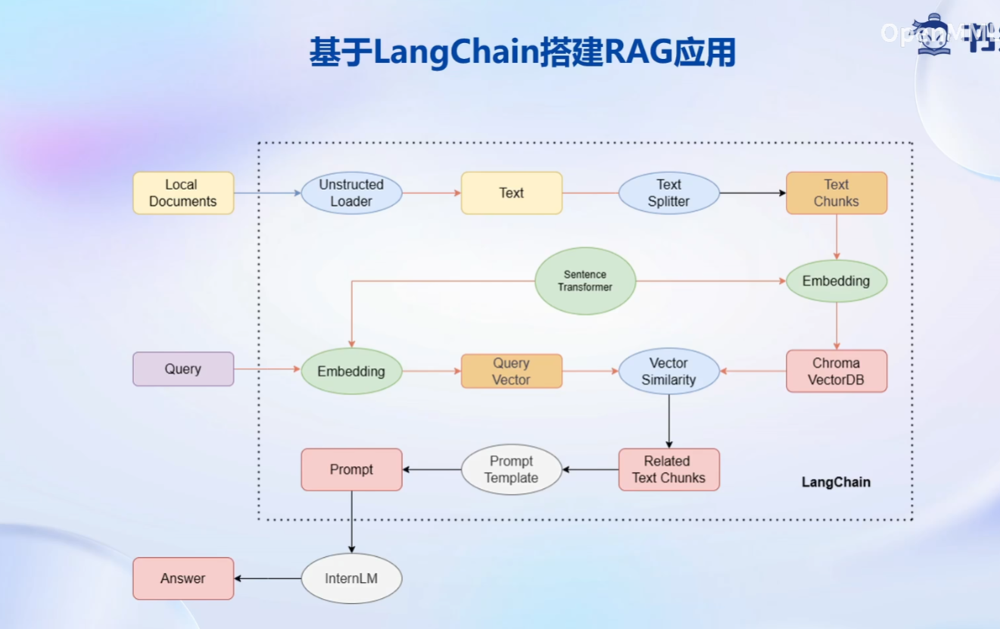

# 第三节：基于 InternLM 和 LangChain 搭建你的知识库


## 目录

- 环境配置
- 项目开发


### 1. 环境配置

```bash
# 创建虚拟环境
conda create --name internlm python=3.10
conda activate internlm
# 升级pip
python -m pip install --upgrade pip
## 可选项 配置pip源
pip config set global.index-url https://mirrors.cernet.edu.cn/pypi/web/simple

# 安装pip库 
pip install modelscope==1.9.5
pip install torch==2.0.1
pip install transformers==4.35.2
pip install streamlit==1.24.0
pip install sentencepiece==0.1.99
pip install accelerate==0.24.1

pip install langchain==0.0.292
pip install gradio==4.4.0
pip install chromadb==0.4.15
pip install sentence-transformers==2.2.2
pip install unstructured==0.10.30
pip install markdown==3.3.7
```


### 2. InternLM + LangChain项目开发



#### 2.1 下载需要的模型

- 下载需要的模型

  - InternLM大模型：internlm-chat-7b

  - sentence Transformer

    ```python
    # download_hf.py
    import os
    
    # 设置环境变量
    os.environ['HF_ENDPOINT'] = 'https://hf-mirror.com'
    
    # 下载模型
    os.system('huggingface-cli download --resume-download sentence-transformers/paraphrase-multilingual-MiniLM-L12-v2 --local-dir /root/data/model/sentence-transformer')
    
    ```

    

- 下载NLTK资源

  ```bash
  cd /root
  git clone https://gitee.com/yzy0612/nltk_data.git  --branch gh-pages
  cd nltk_data
  mv packages/*  ./
  cd tokenizers
  unzip punkt.zip
  cd ../taggers
  unzip averaged_perceptron_tagger.zip
  ```

  

#### 2.2 搭建知识库

- `build_vectorstores.py`：构建本地词向量数据库

- `internlm_model.py`：使用`langchain`格式封装大模型类

- `model.py`: 

  ```python
  def load_chain(vector_db_dir, sentence_transformer_dir, llm_model_dir):
      # 加载问答链
      # 定义 Embeddings
      embeddings = HuggingFaceEmbeddings(model_name=sentence_transformer_dir)
  
      # 向量数据库持久化路径
      persist_directory = vector_db_dir
  
      # 加载数据库
      vectordb = Chroma(
          persist_directory=persist_directory,  # 允许我们将persist_directory目录保存到磁盘上
          embedding_function=embeddings
      )
  
      # 加载自定义 LLM
      llm = InternLM_LLM(model_path = llm_model_dir)
  
      # 定义一个 Prompt Template
      template = """使用以下上下文来回答最后的问题。如果你不知道答案，就说你不知道，不要试图编造答
      案。尽量使答案简明扼要。总是在回答的最后说“谢谢你的提问！”。
      {context}
      问题: {question}
      有用的回答:"""
  
      QA_CHAIN_PROMPT = PromptTemplate(input_variables=["context","question"],template=template)
  
      # 运行 chain
      qa_chain = RetrievalQA.from_chain_type(llm,retriever=vectordb.as_retriever(),return_source_documents=True,chain_type_kwargs={"prompt":QA_CHAIN_PROMPT})
      
      return qa_chain
  ```

  