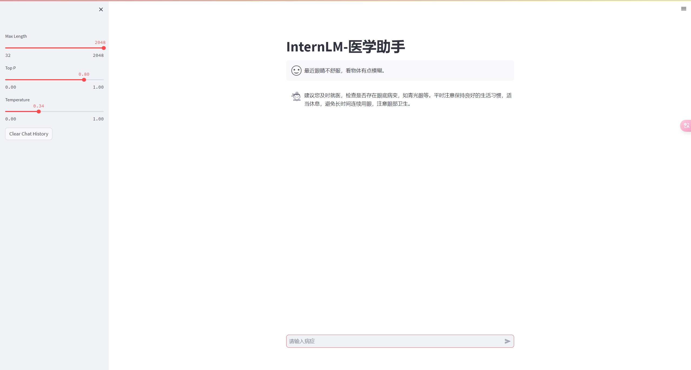

# 第四节：XTuner 大模型单卡低成本微调实战


## 目录

- 环境配置
- 模型微调
- xtuner分析


### 1. 环境配置

```bash
conda create --name xtuner-env python=3.10 -y
conda activate xtuner-env

git clone https://github.com/InternLM/xtuner.git
cd xtuner
pip install -e '.[all]'
```


### 2. 模型微调

这里以 **[Medication QA](https://github.com/abachaa/Medication_QA_MedInfo2019)** **数据集**为例

- 数据处理

  [代码和数据](https://github.com/InternLM/tutorial/tree/main/xtuner)

  ```bash
  python xlsx2jsonl.py
  python split2train_and_test.py
  ```

- 使用xtuner复制出一个训练的配置文件

  ```bash
  xtuner copy-cfg internlm_chat_7b_qlora_oasst1_e3 .
  ```

- 修改`internlm_chat_7b_qlora_oasst1_e3.py`文件

  ```diff
  # 修改import部分
  - from xtuner.dataset.map_fns import oasst1_map_fn, template_map_fn_factory
  + from xtuner.dataset.map_fns import template_map_fn_factory
  
  # 修改模型为本地路径
  - pretrained_model_name_or_path = 'internlm/internlm-chat-7b'
  + pretrained_model_name_or_path = './internlm-chat-7b'
  
  # 修改训练数据为 MedQA2019-structured-train.jsonl 路径
  - data_path = 'timdettmers/openassistant-guanaco'
  + data_path = 'MedQA2019-structured-train.jsonl'
  
  # 修改 train_dataset 对象
  train_dataset = dict(
      type=process_hf_dataset,
  -   dataset=dict(type=load_dataset, path=data_path),
  +   dataset=dict(type=load_dataset, path='json', data_files=dict(train=data_path)),
      tokenizer=tokenizer,
      max_length=max_length,
  -   dataset_map_fn=alpaca_map_fn,
  +   dataset_map_fn=None,
      template_map_fn=dict(
          type=template_map_fn_factory, template=prompt_template),
      remove_unused_columns=True,
      shuffle_before_pack=True,
      pack_to_max_length=pack_to_max_length)
  ```

- 开始训练

  ```bash
  xtuner train internlm_chat_7b_qlora_medqa2019_e3.py --deepspeed deepspeed_zero2
  ```

- 将训练完成的`Adapter`转为`Huggingface`格式

  ```bash
  export MKL_SERVICE_FORCE_INTEL=1
  xtuner convert pth_to_hf internlm_chat_7b_qlora_medqa2019_e3.py ${训练保存的模型路径} ${转换要保存的路径}
  ```

- 合并模型，将`Adapter`与预训练模型合并一起

  ```bash
  xtuner convert merge ./internlm-chat-7b ./hf ./merged --max-shard-size 2GB
  
  # xtuner convert merge \
  #     ${NAME_OR_PATH_TO_LLM} \
  #     ${NAME_OR_PATH_TO_ADAPTER} \
  #     ${SAVE_PATH} \
  #     --max-shard-size 2GB
  ```

- 测试模型: 

  参考[代码](https://github.com/GitEasonXu/Internlm-chat-medical-7b/blob/main/web_demo.py)

  ```bash
  streamlit run web_demo.py
  ```

  


### 3. XTuner项目代码分析

- 为什么输入`xtuner train `命令就能运行起来了呢？

  这里关键的代码主要有：setup.py、xtuner/entry_point.py

  ```python
  ## setup.py 文件中
  entry_points={'console_scripts': ['xtuner = xtuner:cli']})
  ```

  这一句说明了，当在终端输入xtuner命令的时候执行xtuner.cli方法

  ```python
  modes = {
      'list-cfg': list_cfg.__file__,
      'copy-cfg': copy_cfg.__file__,
      'log-dataset': log_dataset.__file__,
      'check-custom-dataset': check_custom_dataset.__file__,
      'train': train.__file__,
      'test': test.__file__,
      'chat': chat.__file__,
      'convert': {
          'pth_to_hf': pth_to_hf.__file__,
          'merge': merge.__file__,
          'split': split.__file__,
          '--help': lambda: print_log(CONVERT_HELP_MSG, 'current'),
          '-h': lambda: print_log(CONVERT_HELP_MSG, 'current')
      },
      'preprocess': {
          'arxiv': arxiv_preprocess.__file__,
          '--help': lambda: print_log(PREPROCESS_HELP_MSG, 'current'),
          '-h': lambda: print_log(PREPROCESS_HELP_MSG, 'current')
      }
  }
  
  
  def cli():
      args = sys.argv[1:]
          return
  ```

  - cli方法首先会解析参数，然后根据参数从`modes字典`中取对应的方法。比如输入：`xtuner train`，其实后端会执行`train.__file__`就是`train.py`文件了。

  