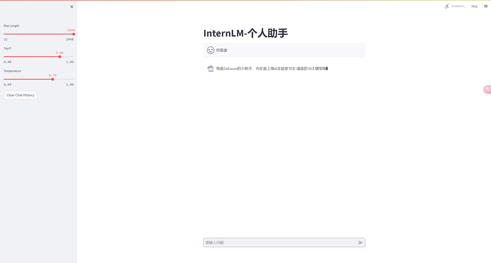
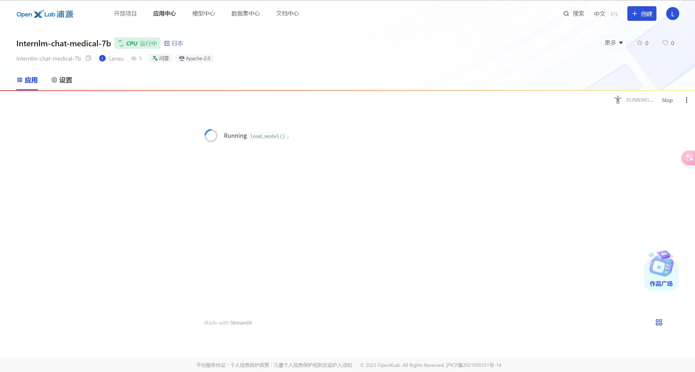

# 第四节：XTuner 大模型单卡低成本微调实战

## 基础作业

- 使用Xtuner微调大模型(截图)

  

## 进阶作业

- 将微调的大模型上传至`ModelScope`上

  [模型链接](https://www.modelscope.cn/models/GitEason/internlm-chat-medical-7b/summary)

- 将训练好后的模型应用部署到 OpenXLab 平台

  由于资源问题一直启动不起来

  