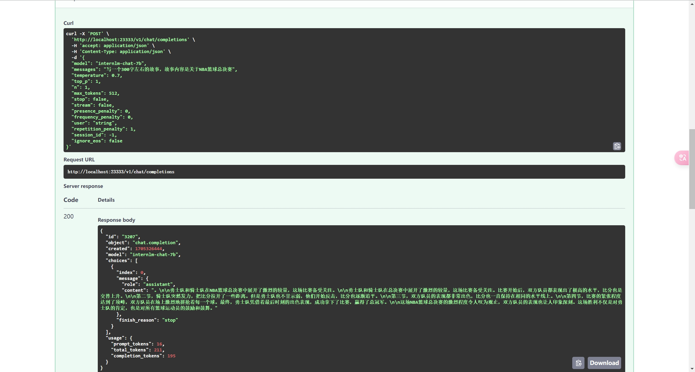
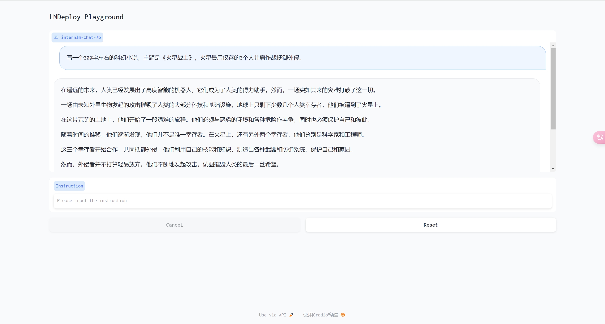

# 第五节：LMDeploy 大模型量化部署实践


## 目录

- 环境配置
- 模型推理
- 模型量化
- LMDeploy 命令机制简单说明


### 1. 环境配置

```bash
conda create --name lmdeploy python=3.10 -y
conda activate lmdeploy

pip install packaging
# 使用 flash_attn 的预编译包解决安装过慢问题
pip install flash_attn
#pip install wheels/flash_attn-2.4.2+cu118torch2.0cxx11abiTRUE-cp310-cp310-linux_x86_64.whl
pip install 'lmdeploy[all]==v0.1.0'
```


### 2. 模型推理

#### 2.1 模型格式转换

这里官方推荐后端使用TurboMind 推理框架，因此需要先将模型转换为`TurboMind`格式，转换方式有两种

- 在线转换：这种方式是直接将模型转换完后，开始进行推理

  ```bash
  lmdeploy chat turbomind Qwen/Qwen-7B-Chat --model-name qwen-7b
  ```

- 离线转换：这种方式是将模型转换完后，保存本地，之后再使用

  ```bash
  #                转换模型类型       要转换模型的路劲
  lmdeploy convert internlm-chat-7b /path/to/internlm-chat-7b
  ```

#### 2.2 模型服务

- TurboMind 推理+命令行本地对话

  ```bash
  lmdeploy chat turbomind ./workspace
  ```

- TurboMind 推理+API服务

  ```bash
  # ApiServer+Turbomind   api_server => AsyncEngine => TurboMind
  # 此时已经开启了模型API服务
  lmdeploy serve api_server ./workspace \
  	--server_name 0.0.0.0 \
  	--server_port 23333 \
  	--instance_num 64 \
  	--tp 1
  ```

  - 使用`api-cli`测试

    ```bash
    lmdeploy serve api_client http://localhost:23333
    ```

  - 使用`fastAPI`测试

    

- TurboMind 推理+Gradio 

  本质还是TurboMind+API服务，只是Gradio作为前端去请求服务

  ```bash
  lmdeploy serve gradio http://0.0.0.0:23333 \
  	--server_name 0.0.0.0 \
  	--server_port 6006 \
  	--restful_api True
  ```

  

### 3 模型量化

LMDeploy提供两种量化方式：KV Cache量化和W4A16量化，具体内容[参考官网介绍](https://github.com/InternLM/tutorial/blob/main/lmdeploy/lmdeploy.md#3-%E6%A8%A1%E5%9E%8B%E9%87%8F%E5%8C%96)

- KV Cache量化

  ```bash
  ## 统计 max min 范围
  lmdeploy lite calibrate \
    --model  /root/share/temp/model_repos/internlm-chat-7b/ \
    --calib_dataset "c4" \
    --calib_samples 128 \
    --calib_seqlen 2048 \
    --work_dir ./quant_output
    
  ## 转换模型
  lmdeploy lite kv_qparams \
    --work_dir ./quant_output  \
    --turbomind_dir workspace/triton_models/weights/ \
    --kv_sym False \
    --num_tp 1
  ```

  

- W4A16

  ```bash
  # 量化权重模型
  lmdeploy lite auto_awq \
    --model  /root/share/temp/model_repos/internlm-chat-7b/ \
    --w_bits 4 \
    --w_group_size 128 \
    --work_dir ./quant_output 
  # 转换成 TurboMind 格式。
  lmdeploy convert  internlm-chat-7b ./quant_output \
      --model-format awq \
      --group-size 128 \
      --dst_path ./workspace_quant
  ```

### 4. LMDeploy代码机制理解

```python
# setup.py
entry_points={'console_scripts': ['lmdeploy = lmdeploy.cli:run']},
```

```python
# lmdeploy.cli.cli.py
def run():
    """The entry point of running LMDeploy CLI."""

    cli = CLI()
    cli.lite = SubCliLite()
    cli.chat = SubCliChat()
    cli.serve = SubCliServe()

    fire.Fire(cli, name='lmdeploy')
```

- 首先`setup.py`中的`entry_points`定义了`lmdeploy`等价于调用了`lmdeploy.cli.run方法`

- `fire.Fire(cli, name='lmdeploy')`所有的关键就是这行代码，`fire`库又是什么呢？Fire是一个用于从任何Python对象自动生成命令行界面（CLI）的库，具体用法网上搜搜。它能实现的功能就是

  ```python
  # 输入以下这条指令
  lmdeploy lite auto_awq \
    --model  /root/share/temp/model_repos/internlm-chat-7b/ \
    --w_bits 4 \
    --w_group_size 128 \
    --work_dir ./quant_output 
    
  # 实际调用的是这个函数
  cli.lite.auto_awq(model=/root/share/temp/model_repos/internlm-chat-7b/, w_bits=4, ...)
  ```

大致就先介绍到这里了，以后有机会再好好学习源码。