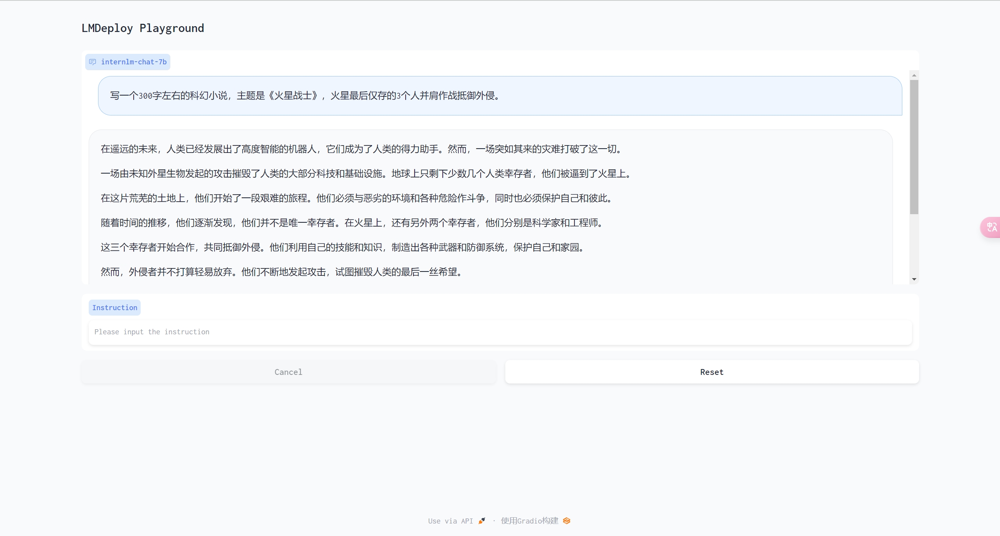

# 第五节：LMDeploy 大模型量化部署实践

## 基础作业

- 使用 LMDeploy 以网页Gradio方式部署 InternLM-Chat-7B 模型

  
  
- 使用 LMDeploy 以API服务方式部署 InternLM-Chat-7B 模型

  

## 进阶作业

- 对internlm-chat-7b模型KV Cache量化

  

- 对internlm-chat-7b模型W4A16量化

  